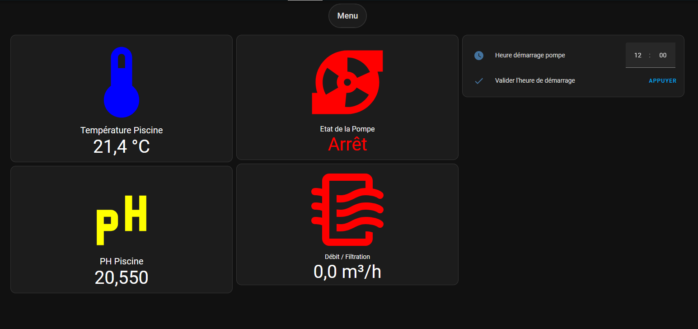

# Projet automatisation piscine

Suivant le partage d'experience de certains youtubeurs et dans la communauté https://forum.hacf.fr/ J'ai voulu me lancer aussi dans ce DIY.

Pour une piscine traitement au sel.
Via un ESP32 je veux remonter l'information de la température, du ph et via un débitmètre l'etat du debit qui sera un retour aussi du filtre.

Pour l'instant tout est a l'état de prototype, fixé sur une platine d'essais.

## Vue sur Home Assistant

Bien entendu rien n'est calibré et je n'ai pas ma sonde ph de branchée.

## Matériel achete:

- ESP32WROOM32D micro usb + une carte de developpement support
- module 4 relais
- sonde dallas DS18B20
- convertisseur analogique/numerique ADS1115
- une sonde ph
- un débitmétre YF-S201 en DN50
- un écran Nextion NX4832T035_11 (ce dernier bug!?! oui sur le forum de HACF, j'ai demandé confirmation)
- quelques resistances de 4.7kOhms et 10kOhms pour les entrees pullup.

Le reste est de la recupe comme une alimentation 5v 3a....
Lors de la prochaine remise en route je dois prevoir l'installation des sondes.

## Les sous dossiers

Je separe chaque élements dans des sous dossiers pour realiser un distinguo, j'ai trouvé certaines libraires avec HACS pour la réalisation des cards...

## PumpAutomation.py

J'ai un interrupteur 3 positions off/ marche forcée/ marche auto. Ce dernier au coffret piscine, permet une maintenance, un traitement d'eau en marche forcée et enfin le mode auto. Je dois inclure une securite etat filtre pour eviter des surpressions ...par exemple. Suivant diverses recherches, le temps de fonctionnement d'une pompe varie avec la temperature. Une filtration de nuit est dite non utile. Donc a adapter les if/else au besoin. Une prise en compte du changement d'heure de programmation.

## ESPHome

J'ai quelques lignes ou je suis revenu a une configuration minimal de mon écran nextion. Ce dernier ne voulais plus de mes logs au changement de page après 5s de fonctionnement. Je ne connais pas la cause.

## Les cards

Pour realiser mes cards je passe directement par l'éditeur manuel en yaml. Ainsi visuellement certaines icones changent de couleur pour alerter.

## Prochain objectifs

- Simuler l'etat du filtre pour arreter la pompe et intégrer une sécurité.
- Commander un nouvel ecran pour dedouaner le premier
- Au printemps realiser l'installation
- Pour un traitement optimal au sel, il est necessaire d'avoir un ph compris entre 7.2 et 7.4. Donc piloter une pompe péristaltique avec une automatisation.